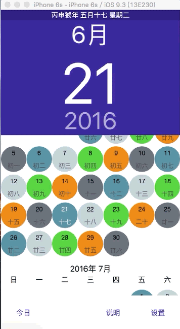

# 

   

# 护士APN排班日历 

    在医院上班的护士朋友，总是记不住她上什么班，有了这个DIY日历，就能轻松知道她的班次(APN下休)了,是一款可以显示农历和公历的日历控制器。

## 预览

 

## 项目相关

### 项目环境

          

### 项目结构

```
Classes                             
    - Model                        数据模型
    - View                         交互界面
    - Controller                   逻辑控制
    - Other                        三方库存放                   
```

## 建议及问题反馈

+ E-mail: [wizen_zhang@163.com](wizen_zhang@163.com)
+ GitHub: [https://github.com/WizenZhang/Nurse-APN/issues](https://github.com/WizenZhang/Nurse-APN/issues)

## 致谢

感谢[chjsun](https://github.com/chjsun/CJCalendar)提供的iOS开源代码库，为本项目的形成提供了很大的帮助。

***

By [Wizen Zhang](https://wizenzhang.github.io/).
